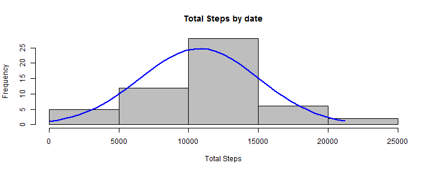
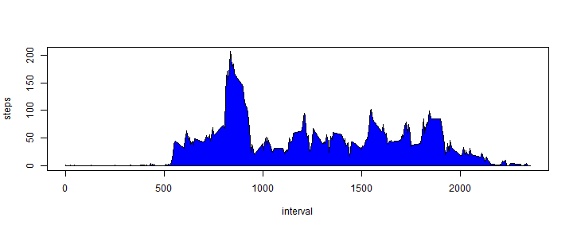
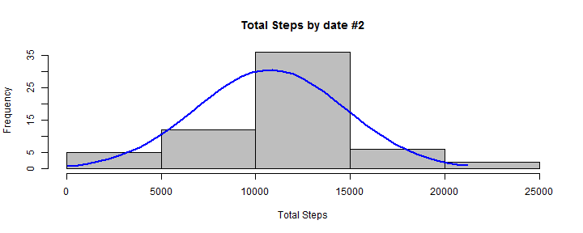
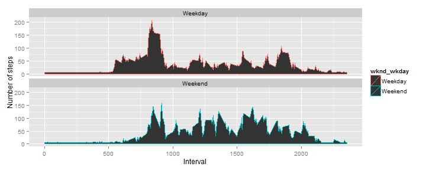
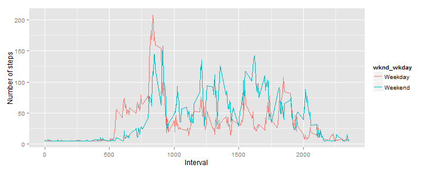

## Loading and preprocessing the data


```r
#Does the /data directory exist, if not create it
#Has the activity data been extracted, if not extract it into the /data directory
if(!file.exists("data")){
  dir.create("data")
}else if(!file.exists("data/activity.csv")){
    unzip("activity.zip", exdir = "data")
}
```


```r
csvRaw <-read.csv("data/activity.csv")
totalRows<-nrow(csvRaw)
uniqueDates<-length(unique(csvRaw$date))
summary(csvRaw)
```

```
##      steps                date          interval     
##  Min.   :  0.00   2012-10-01:  288   Min.   :   0.0  
##  1st Qu.:  0.00   2012-10-02:  288   1st Qu.: 588.8  
##  Median :  0.00   2012-10-03:  288   Median :1177.5  
##  Mean   : 37.38   2012-10-04:  288   Mean   :1177.5  
##  3rd Qu.: 12.00   2012-10-05:  288   3rd Qu.:1766.2  
##  Max.   :806.00   2012-10-06:  288   Max.   :2355.0  
##  NA's   :2304     (Other)   :15840
```
The raw activity data contains 17,568 rows and  61 unique dates.


```r
omittedNA <-na.omit(csvRaw)

totalRowsOmitNAs<-nrow(omittedNA)
uniqueDatesNoNAs<-length(unique(omittedNA$date))
summary(omittedNA)
```

```
##      steps                date          interval     
##  Min.   :  0.00   2012-10-02:  288   Min.   :   0.0  
##  1st Qu.:  0.00   2012-10-03:  288   1st Qu.: 588.8  
##  Median :  0.00   2012-10-04:  288   Median :1177.5  
##  Mean   : 37.38   2012-10-05:  288   Mean   :1177.5  
##  3rd Qu.: 12.00   2012-10-06:  288   3rd Qu.:1766.2  
##  Max.   :806.00   2012-10-07:  288   Max.   :2355.0  
##                   (Other)   :13536
```

After omitting NAs, the activity data now contains 15,264 rows and 53 unique dates.
We have ommtted 2,304 incomplete cases.

<hr>
## What is mean total number of steps taken per day?
1. Calculate the total number of steps taken per day

```r
sumByDate<-aggregate(omittedNA$steps~omittedNA$date,FUN=sum)
names(sumByDate)<-c("date","steps")
mean_total_steps_count<-nrow(sumByDate)
```
The total number of rows from the aggregate of steps ~ date is 53.


2. Histogram


```r
myHist<-hist(sumByDate$steps,xlab="Total Steps",main="Total Steps by date",col="gray")
xfit<-seq(min(sumByDate$steps),max(sumByDate$steps),length=40)
yfit<-dnorm(xfit,mean=mean(sumByDate$steps),sd=sd(sumByDate$steps))
yfit <- yfit*diff(myHist$mids[1:2])*length(sumByDate$steps)
lines(xfit, yfit, col="blue", lwd=2)
```

 


3. Calculate and report the mean and median of the total number of steps taken per day


```r
theMean<-mean(sumByDate$steps)
theMedian<-median(sumByDate$steps)
theMean
```

```
## [1] 10766.19
```

```r
theMedian
```

```
## [1] 10765
```
The mean of the total steps by date is 10,766.19 and the median is 10,765.
<hr>


**What is the average daily activity pattern?**

1. Make a time series plot (i.e. type = "l") of the 5-minute interval (x-axis) and the average number of steps taken, averaged across all days (y-axis)


```r
steps_interval <- aggregate(steps ~ interval, data = omittedNA, FUN = mean)

par(pch=22)
plot(steps_interval,type="l")
polygon(c(min(steps_interval$interval), steps_interval$interval, max(steps_interval$interval)), c(min(steps_interval$steps), steps_interval$steps, min(steps_interval$steps)),  col = "blue") 
```

 
<hr>

2. Which 5-minute interval, on average across all the days in the dataset, contains the maximum number of steps?


```r
max_stepsByDay<-aggregate(steps ~ interval+date, data = omittedNA, FUN = mean)
max_steps<-max_stepsByDay[which.max(max_stepsByDay$steps),]
r_steps <- max_steps$steps
r_interval <- max_steps$interval
r_date <-max_steps$date
```


The 5-minute interval containing the maxium number of steps   is interval 615 with 806 steps on 2012-11-27.
<hr>


## Imputing missing values


```r
raw<-csvRaw
totalNonCompleteRows <-sum(!complete.cases(raw))
```
1. Calculate and report the total number of missing values in the dataset (i.e. the total number of rows with NAs): <b>2,304</b>

2. Devise a strategy for filling in all of the missing values in the dataset. The strategy does not need to be sophisticated. For example, you could use the mean/median for that day, or the mean for that 5-minute interval, etc.

3. Create a new dataset that is equal to the original dataset but with the missing data filled in.


```r
totalRawcount<-nrow(csvRaw)
#Replace all NA's with the mean of the column
raw$steps[is.na(raw$steps)] = mean(raw$steps, na.rm=TRUE)
raw$interval[is.na(raw$interval)] = mean(raw$interval, na.rm=TRUE)
countOfFilledIn<-nrow(raw)

summary(raw)
```

```
##      steps                date          interval     
##  Min.   :  0.00   2012-10-01:  288   Min.   :   0.0  
##  1st Qu.:  0.00   2012-10-02:  288   1st Qu.: 588.8  
##  Median :  0.00   2012-10-03:  288   Median :1177.5  
##  Mean   : 37.38   2012-10-04:  288   Mean   :1177.5  
##  3rd Qu.: 37.38   2012-10-05:  288   3rd Qu.:1766.2  
##  Max.   :806.00   2012-10-06:  288   Max.   :2355.0  
##                   (Other)   :15840
```

```r
omittedNARaw <-na.omit(raw)
CountOfFilledInWithoutNAs<-nrow(omittedNARaw)
```
The original count of rows was 17,568, there are 2,304 incomplete rows in the orignal dataset.

We utilized the mean of the column as a replacement for any NAs of the column. The total number of rows after replacing all NAs with the mean of the column is 17,568. 

To validate our results we performed a na.omit on the data frame and come up with 17,568 as its row count.


<hr>
4. Make a histogram of the total number of steps taken each day and Calculate and report the mean and median total number of steps taken per day. Do these values differ from the estimates from the first part of the assignment? What is the impact of imputing missing data on the estimates of the total daily number of steps?

```r
sumByDate_noNAs<-aggregate(raw$steps~raw$date,FUN=sum)
names(sumByDate_noNAs)<-c("date","steps")

theNewMean <- mean(sumByDate_noNAs$steps)
theNewMedian <-median(sumByDate_noNAs$steps)


NaFilledHist<-hist(sumByDate_noNAs$steps,xlab="Total Steps",main="Total Steps by date #2",col="gray")
xfit<-seq(min(sumByDate_noNAs$steps),max(sumByDate_noNAs$steps),length=40)
yfit<-dnorm(xfit,mean=mean(sumByDate_noNAs$steps),sd=sd(sumByDate_noNAs$steps))
yfit <- yfit*diff(NaFilledHist$mids[1:2])*length(sumByDate_noNAs$steps)
lines(xfit, yfit, col="blue", lwd=2)
```

 

The original mean was 10,766.19 and the new mean is 10,766.19.
The original median was 10,765 and the new median is 10,766.19.
<hr>
## Are there differences in activity patterns between weekdays and weekends?


1. Create a new factor variable in the dataset with two levels -- "weekday" and "weekend" indicating whether a given date is a weekday or weekend day.

```r
raw$daysOfWeek<-weekdays(as.Date(raw$date))
raw[sample(nrow(raw),5),]
```

```
##       steps       date interval daysOfWeek
## 5527      0 2012-10-20      430   Saturday
## 2775      0 2012-10-10     1510  Wednesday
## 4500      0 2012-10-16     1455    Tuesday
## 1695      0 2012-10-06     2110   Saturday
## 14056    84 2012-11-18     1915     Sunday
```

```r
raw$wknd_wkday<- as.factor(ifelse(raw$daysOfWeek %in% c("Saturday","Sunday"), "Weekend", "Weekday")) 
raw[sample(nrow(raw),5),]
```

```
##         steps       date interval daysOfWeek wknd_wkday
## 10569  0.0000 2012-11-06     1640    Tuesday    Weekday
## 4599   0.0000 2012-10-16     2310    Tuesday    Weekday
## 11619 37.3826 2012-11-10      810   Saturday    Weekend
## 5214   0.0000 2012-10-19      225     Friday    Weekday
## 14010  0.0000 2012-11-18     1525     Sunday    Weekend
```
<hr>

2. Make a panel plot containing a time series plot (i.e. type = "l") of the 5-minute interval (x-axis) and the average number of steps taken, averaged across all weekday days or weekend days (y-axis). 


```r
library(ggplot2)
steps_by_interval <- aggregate(steps ~ interval + wknd_wkday, raw, mean)
weekday_means<- aggregate(steps ~ wknd_wkday, steps_by_interval, mean)
names(weekday_means)<-c("wknd_wkday","mean_steps")
weekday_means
```

```
##   wknd_wkday mean_steps
## 1    Weekday   35.61058
## 2    Weekend   42.36640
```

```r
weekday_median<- aggregate(steps ~ wknd_wkday, steps_by_interval, median)
names(weekday_median)<-c("wknd_wkday","median_steps")
weekday_median
```

```
##   wknd_wkday median_steps
## 1    Weekday     25.76212
## 2    Weekend     32.70407
```

```r
qplot(interval,steps,data = steps_by_interval,type = 'l',geom=c("line"),xlab="Interval",ylab="Number of steps",color=wknd_wkday) +facet_wrap(~ wknd_wkday, ncol = 1)+ geom_area()
```

 

```r
qplot(interval,steps,data = steps_by_interval,type = 'l',geom=c("line"),xlab="Interval",ylab="Number of steps",color=wknd_wkday) #+facet_wrap(~ wknd_wkday, ncol = 1)
```

 
<hr><br>
End
